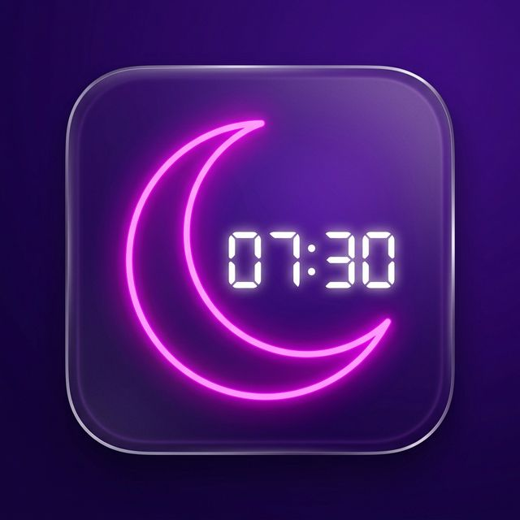

<div align="center">
  

  # WakeUp - AI Alarm

  **A modern, beautifully designed alarm clock that makes sure you actually wake up.**  
  *Powered by React, Capacitor, and TensorFlow.js (AI Object Detection)*

  [](https://react.dev/)
  [](https://www.typescriptlang.org/)
  [](https://capacitorjs.com/)
  [](https://www.tensorflow.org/js)
</div>

---

## 🌟 Overview

**WakeUp** isn't your average alarm clock. It's a progressive web application (PWA) packaged as a fully native Android application that integrates **AI-powered object detection** to ensure you're truly awake. 

Ever snoozed your alarm without realizing it? WakeUp forces you to get out of bed and verify a specific physical object (like a "cup", "chair", or "sink") using your device's camera before the alarm turns off. Combined with a sleek, luxury-themed dark mode UI and frictionless native Android background alarm support, your mornings will be both stylish and strictly enforced.

---

## 📸 App Showcase

> **Note to Contributor:** Replace these placeholder links with actual images and MP4/GIF file paths once you've recorded the demo.

### Video Demo
<a href="https://github.com/your-username/wakeup-luxury/assets/placeholder-video.mp4">
  
</a>

*(Or embed directly if supported in your markdown viewer:)*
```html
<video src="docs/demo.mp4" width="600" controls></video>
```

### Screenshots

<div align="center">
  
  
  
</div>

---

## ✨ Features

- 🧠 **AI Object Verification:** Uses `@tensorflow-models/coco-ssd` to run completely on-device. The alarm only stops if you scan the right object!
- 📱 **Native Android Background Support:** Bypasses standard Doze mode and background restrictions using pure Android Native code via Capacitor Plugins (`AlarmManager` & Insistent Notifications). Alarms *will* ring, even if the app is killed.
- 🎨 **Luxury UI / UX:** Beautiful, creamy, modern dark-themed animations powered by `framer-motion`.
- ⚡ **Offline First:** Built as a Progressive Web App (PWA) using `vite-plugin-pwa` — works flawlessly offline.
- 🔒 **Privacy Focused:** The camera stream and AI models operate 100% locally on your phone. No data is sent to the cloud.

---

## 🛠️ Technology Stack

- **Frontend:** React 19, TypeScript, Vanilla CSS (Custom Design System), Framer Motion
- **AI & ML:** TensorFlow.js (`coco-ssd`)
- **Build Tool:** Vite
- **Mobile Container:** Ionic Capacitor
- **Native Implementation:** Java (Android `AlarmManager`, BroadcastReceivers, WakeLocks)

---

## 🚀 Getting Started

### Prerequisites
- [Node.js](https://nodejs.org/en/) (v18+ recommended)
- [Android Studio](https://developer.android.com/studio) (for building the Android APK)
- Java Development Kit (JDK 17)

### 1. Clone the repository
```bash
git clone https://github.com/your-username/wakeup-luxury.git
cd wakeup-luxury
```

### 2. Install Dependencies
```bash
npm install
```

### 3. Environment Variables (Important!)
All sensitive API keys and environment configurations are strictly ignored from source control.
If the app requires any environment variables, copy the example file and fill in your keys:
```bash
cp .env.example .env
```
*(Ensure you **never** commit your `.env` file to a public repository!)*

### 4. Run Development Server (Web)
```bash
npm run dev
```

### 5. Run on Android Device / Emulator
To test the native features like the background Alarm mechanisms, you must run it on an Android device/emulator:
```bash
# Build the web assets
npm run build

# Sync assets to Capacitor Android project
npx cap sync android

# Open in Android Studio to build and compile the APK
npx cap open android
```
*(Alternatively, run it live with HMR using `npm run dev:android` if your device connects locally).*

---

## 🏗️ Project Structure

```text
wakeup-luxury/
├── android/               # Native Android application source code
├── public/                # Static assets (icons, manifest)
├── src/
│   ├── components/        # Reusable React components UI (Framer Motion)
│   ├── screens/           # Main application screens/views
│   ├── theme/             # Design specs and layout configs
│   ├── utils/             # Helper functions (NativeAlarm, TensorFlow)
│   ├── App.tsx            # Application entrypoint
│   └── main.tsx           # React DOM rendering
├── .gitignore             # Strict ignore rules protecting .env/.local files
├── capacitor.config.ts    # Capacitor specific configurations
└── vite.config.ts         # Vite bundler configurations (PWA setup)
```

---

## 🛡️ Security & Privacy Notice

- **API Keys:** This repository is configured to block any `.env`, `.env.local`, or secret configuration files from being committed via `.gitignore`.
- **Local AI Context:** TensorFlow.js operations are strictly on-device. No visual information or camera feed is uploaded.

## 📄 License

This project is licensed under the MIT License - see the [LICENSE](LICENSE) file for details.

---

<div align="center">
  <i>Sleep better, Wake up smarter. Crafted with ❤️</i>
</div>
